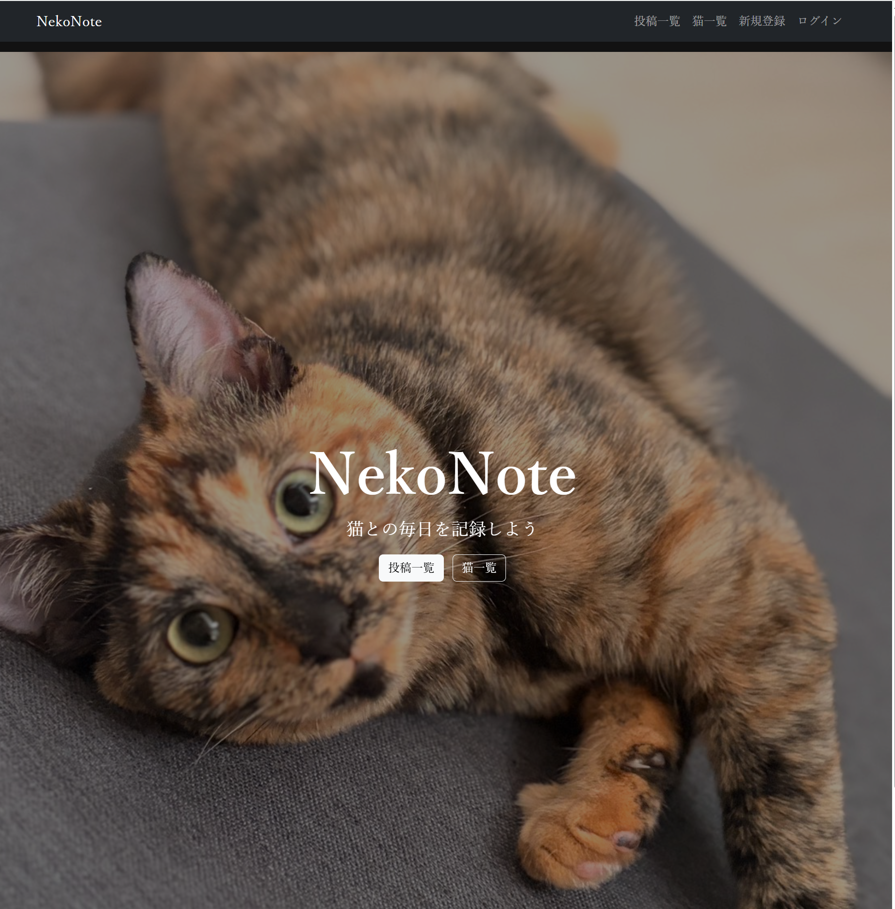
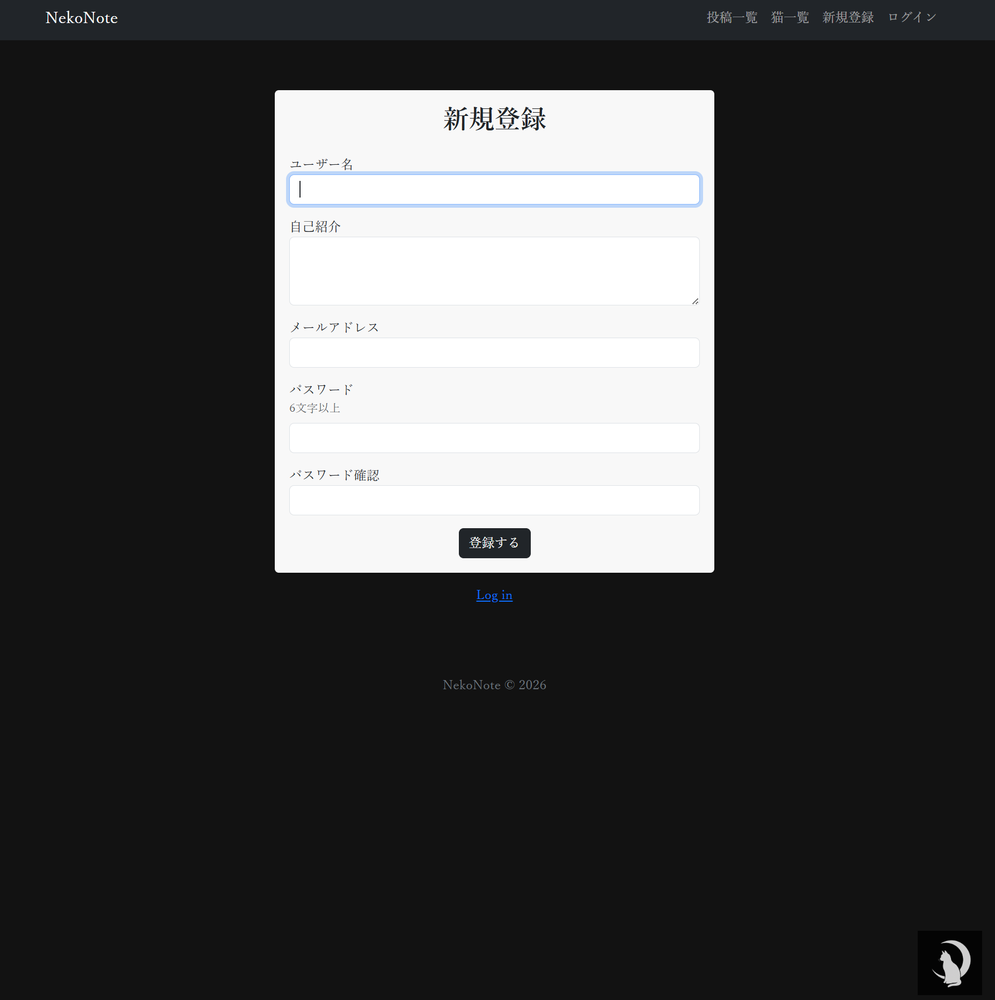
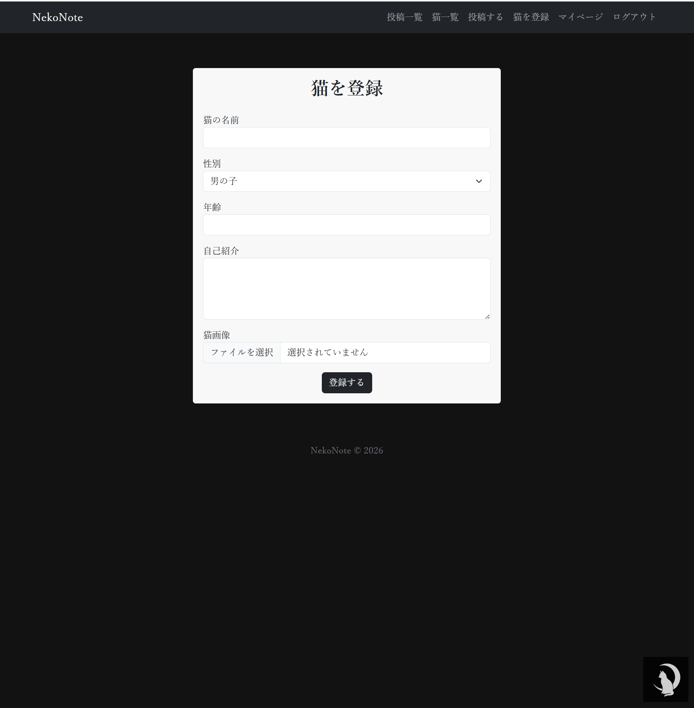
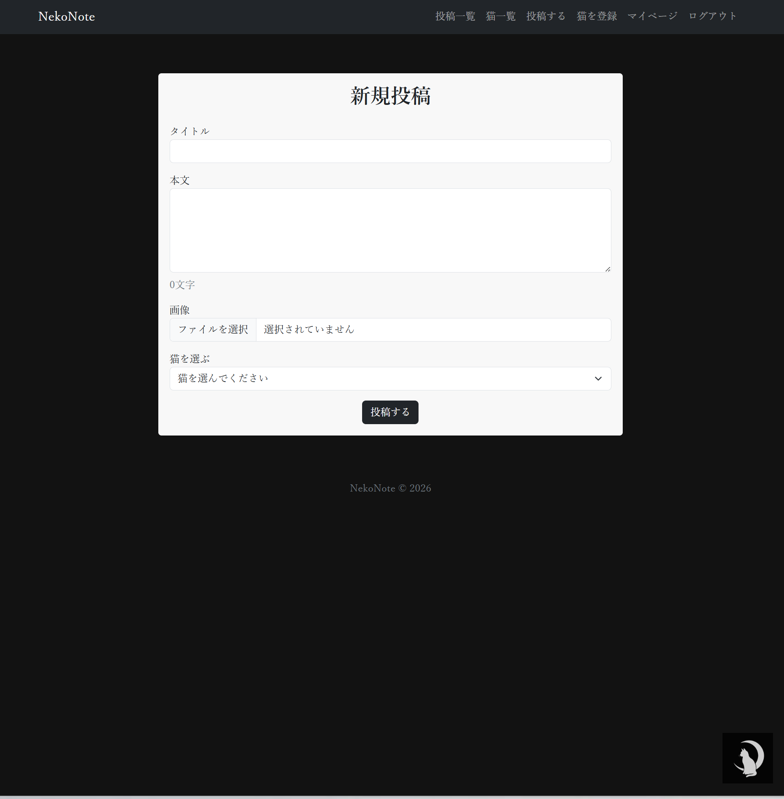
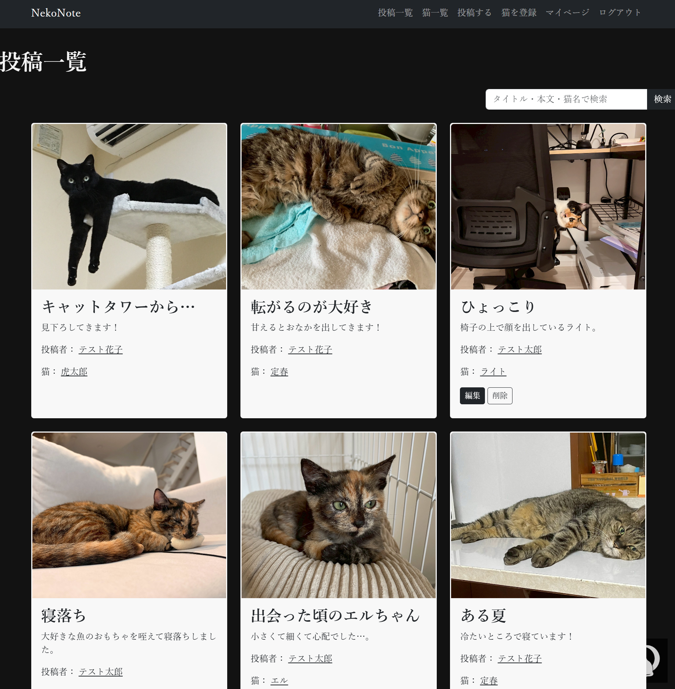
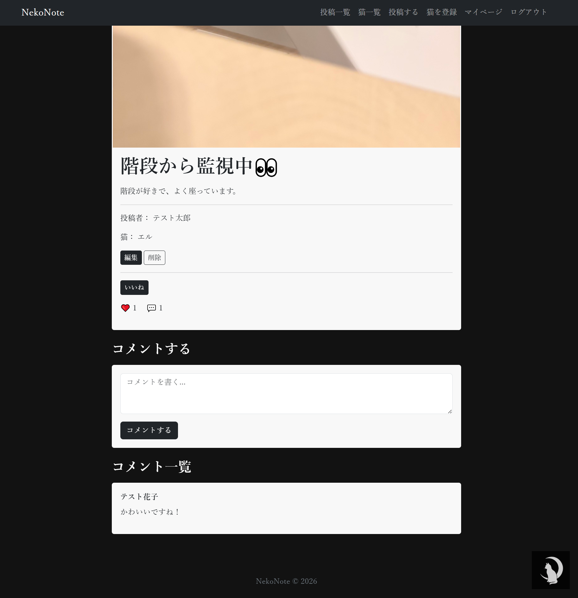
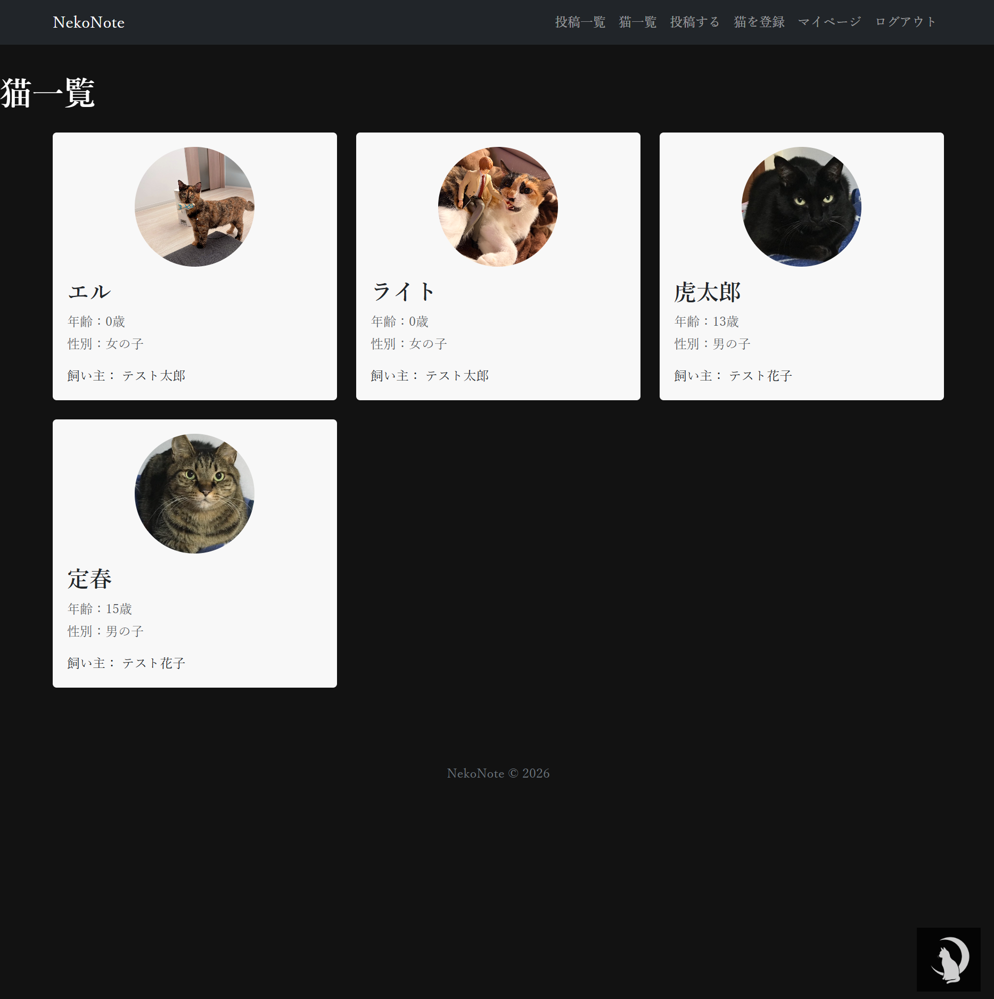
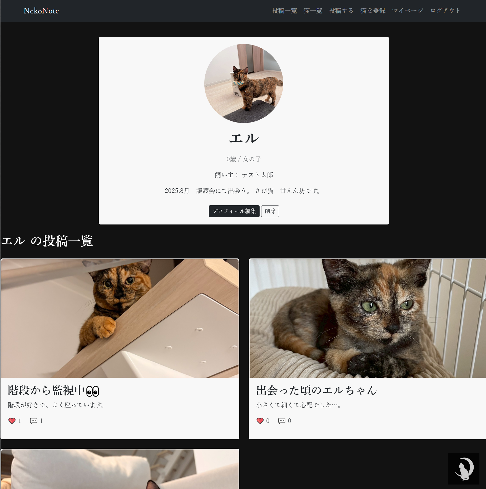

# Neko Note 🐱📓

---

## アプリ概要

Neko Noteは、猫の写真や日常を記録・共有するためのSNSアプリです。

ユーザーは猫ごとにプロフィールを登録し、その猫に紐づいた投稿を作成できます。

コメントやいいね機能を通じて他のユーザーと交流することも可能です。

---

## サイトテーマ

「愛猫との日常を記録し、共有できる猫専用SNS」

---

## テーマを選んだ理由

私は現在2匹の猫を飼っており、実家でも2匹の猫を飼っています。

日々たくさんの写真を撮影していますが、それぞれ性格や特徴が異なるため、「猫ごとに思い出を管理できるサービスがあれば便利なのではないか」と感じました。

また、SNSでは投稿が時系列で流れてしまうため、後から特定の猫の記録を振り返りづらいという課題もあります。

そこで、猫ごとにプロフィールを作成し、その猫専用の成長記録を残せるサービスとしてNeko Noteを制作しました。

## 【きっかけ】

猫の写真や思い出を振り返る際に、どの猫の記録なのか分かりにくくなることがありました。

猫ごとにプロフィールを作成し、投稿を整理できるサービスがあれば、より見返しやすく記録を残せると考えました。

## 【問題点】

・SNSでは複数の猫の投稿が混在してしまう

・猫ごとの成長記録を管理しにくい

・他の猫好きユーザーとの交流機会が少ない

## 【解決策】

・猫ごとにプロフィールを作成し、投稿を紐づける

・画像付きで成長記録を保存できる

・フォロー、いいね、コメント機能で交流できる

・検索機能により投稿を探しやすくする

---

## ターゲットユーザー

・猫を飼っている人

・猫の成長記録を残したい人

・猫好きの人

---

## 主な利用シーン

・日常の猫の様子を記録するとき

・成長記録や思い出を振り返るとき

・他のユーザーの猫を見て楽しみたいとき

---

## 利用方法

① トップページ

---

② ユーザー登録・ログイン

ユーザー登録を行い、Neko Noteにログインします。

---

③ 猫を登録

愛猫の名前や年齢、性別、プロフィール画像を登録します。

猫ごとにプロフィールを作成することで、それぞれの猫の記録を管理できます。

---

④ 猫の日常を投稿

登録した猫を選択し、写真や日常の出来事を投稿します。

投稿にはタイトル・本文・画像を設定できます。

---

⑤ 投稿を閲覧する

投稿一覧から他のユーザーの投稿を閲覧できます。

キーワード検索を利用して、見たい投稿を探すことも可能です。

---

⑥ 投稿の詳細を確認する

投稿の詳細ページでは、投稿内容を確認できます。

また、コメントやいいねを通じてほかのユーザーと交流できます。

---

⑦ 猫を閲覧する

猫一覧から他ユーザーが登録している猫を含め閲覧できます。

---

⑧ 猫の詳細を閲覧する

猫の詳細ページではその猫の投稿をまとめて確認できます。

---

## 機能一覧

・ユーザー認証機能（Devise）

・猫プロフィール登録機能

・投稿機能（CRUD）

・画像投稿機能（Active Storage）

・コメント機能

・いいね機能

・フォロー機能

・検索機能（タイトル検索、本文検索、猫名検索）

・ページネーション機能（Kaminari）

・フラッシュメッセージ表示

・削除確認ダイアログ

---

## 工夫した点

・猫ごとにプロフィールを作成し、投稿を管理できる設計にした

・タイトル、本文、猫名の3項目から検索できるようにした

・ページネーションを導入し、投稿一覧を見やすくした

・フラッシュメッセージや確認ダイアログを追加し、操作性を向上させた

---

## 開発環境

・OS：Windows11

・言語：HTML / CSS / JavaScript / Ruby

・フレームワーク：Ruby on Rails

・データベース：SQLite3

・CSSフレームワーク：Bootstrap

・認証：Devise

・ページネーション：Kaminari

・画像管理：Active Storage

・バージョン管理：Git / GitHub